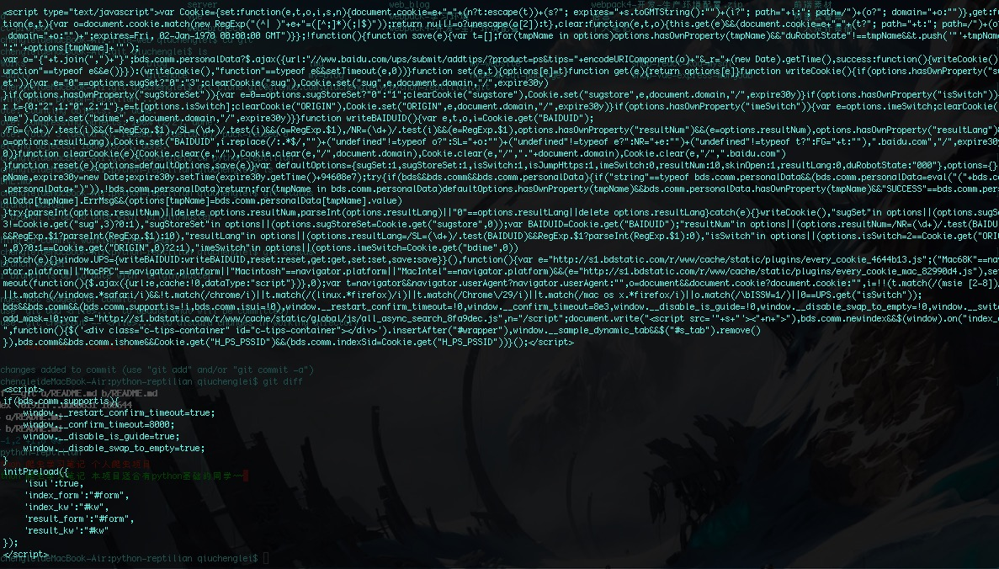

# python-reptilian
python 爬虫学习笔记 本项目适合有python基础的同学~~ 

### 什么是爬虫

爬虫，即网络爬虫，大家可以理解为在网络上爬行的一直蜘蛛，互联网就比作一张大网，而爬虫便是在这张网上爬来爬去的蜘蛛咯，如果它遇到资源，那么它就会抓取下来

比如它在抓取一个网页，在这个网中他发现了一条道路，其实就是指向网页的超链接，那么它就可以爬到另一张网上来获取数据。这样，整个连在一起的大网对这之蜘蛛来说触手可及，分分钟爬下来不是事儿。

### Urllib库的使用

* 扒网页

```py

import urllib2
 
response = urllib2.urlopen("http://www.baidu.com")
print response.read();


```

* 最终在终端输出如下：  你会看到如下完整的html源码



##### 方法

* urlopen(url, data, timeout);

从字面上看三个参数也能猜出: url就是URL(必需) data访问url传的数据 timeout超时

 第二三个参数是可以不传送的，data默认为空None，timeout默认为 socket._GLOBAL_DEFAULT_TIMEOUT

*  response.read() 

返回网络数据 就是我们刚刚读到的网页内容

写的时候建议加上 request对象

```py
import urllib2
 
request = urllib2.Request("http://www.baidu.com")
response = urllib2.urlopen(request)
print response.read()
```


### headers设置


```py
import urllib  
import urllib2  
 
url = 'http://www.server.com/login'
user_agent = 'Mozilla/4.0 (compatible; MSIE 5.5; Windows NT)'  
values = {'username' : 'cqc',  'password' : 'XXXX' }  
headers = { 'User-Agent' : user_agent }  
data = urllib.urlencode(values)  
request = urllib2.Request(url, data, headers)  
response = urllib2.urlopen(request)  
page = response.read() 
```

设置了一个headers，在构建request时传入，在请求时，就加入了headers传送，服务器若识别了是浏览器发来的请求，就会得到响应

* headers
	* User-Agent : 有些服务器或 Proxy 会通过该值来判断是否是浏览器发出的请求
	* Content-Type : 在使用 REST 接口时，服务器会检查该值，用来确定 HTTP Body 中的内容该怎样解析。
	* application/xml ： 在 XML RPC，如 RESTful/SOAP 调用时使用
	* application/json ： 在 JSON RPC 调用时使用
	* application/x-www-form-urlencoded ： 浏览器提交 Web 表单时使用
	* 在使用服务器提供的 RESTful 或 SOAP 服务时， Content-Type 设置错误会导致服务器拒绝服务


### 代理设置

使用代理可以让代理服务器帮助你工作

```py
import urllib2
enable_proxy = True
proxy_handler = urllib2.ProxyHandler({"http" : 'http://some-proxy.com:8080'})
null_proxy_handler = urllib2.ProxyHandler({})
if enable_proxy:
    opener = urllib2.build_opener(proxy_handler)
else:
    opener = urllib2.build_opener(null_proxy_handler)
urllib2.install_opener(opener)

```

### 超时设置

```py
import urllib2
response = urllib2.urlopen('http://www.baidu.com', timeout=10)

```

### DebugLog

可以通过下面的方法把 Debug Log 打开，这样收发包的内容就会在屏幕上打印出来，方便调试

```py
import urllib2
httpHandler = urllib2.HTTPHandler(debuglevel=1)
httpsHandler = urllib2.HTTPSHandler(debuglevel=1)
opener = urllib2.build_opener(httpHandler, httpsHandler)
urllib2.install_opener(opener)
response = urllib2.urlopen('http://www.baidu.com')
```

### UrlError
* 原因可能如下
	* 网络无连接，即本机无法上网
	* 连接不到特定的服务器
	* 服务器不存在

```py
import urllib2
 
requset = urllib2.Request('http://www.xxxxx.com')
try:
    urllib2.urlopen(request)
except urllib2.URLError, e:
    print e.reason

```

### 正则表达式

使用： import re

* re.match(pattern, string[, flags])

* re.search(pattern, string[, flags])

* re.split(pattern, string[, maxsplit])

* re.findall(pattern, string[, flags])

* re.finditer(pattern, string[, flags])

* re.sub(pattern, repl, string[, count])

* re.subn(pattern, repl, string[, count])


